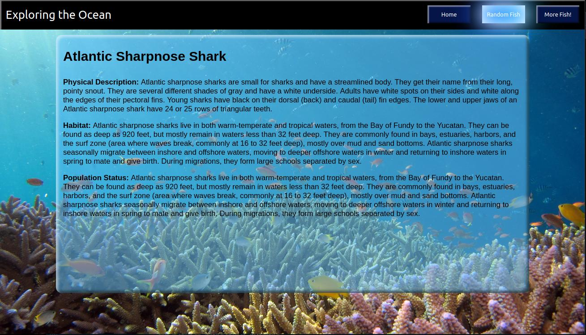
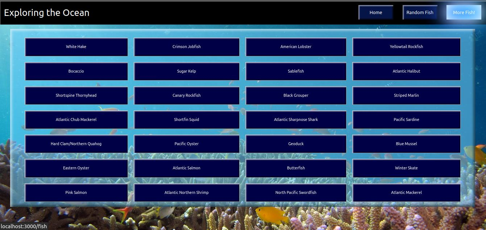

# Fish Project Using API Created By Classmate

## Description

Our assignment was to use a fellow colleague's API and build out the front end.  This project takes you through the best habitat details for some of our most exotic fish.  You can navigate through random fish or select any that you would like to learn more about.  The API was created by **Jose Calderon**, GitHub: https://github.com/HowzayCalderon

- GitHub Link: https://github.com/Jagerziel/Fish
- Deployed (Netlify) Link: https://exploring-the-ocean.netlify.app/
- Home Directory: http://localhost:3000/
- Colleague's API is sourced from https://github.com/HowzayCalderon/projectTwoAPI
- Original API source is https://www.fishwatch.gov/developers

## Navigation

This site allows you to navigate through three screens.  The first is a homescreen that provides a little bit of information about our friends in the see (sourced from National Geographic).  The second allows you to view a random fish (click as many times as you want to learn more about different species).  And the third provides a full view of the API data.  Clicking on a box will bring up a modal with additional information on that particular fish.

### ***Home Page Screenshot***

### ***Random Fish Screenshot***

### ***More Fish! Screenshot***

## Pages

To navigate to an individual page via the URL, use the following:
1) Home:  https://exploring-the-ocean.netlify.app/
2) Random Fish: https://exploring-the-ocean.netlify.app/random-fish
3) More Fish!: https://exploring-the-ocean.netlify.app/fish

## Technical Notes

### Data

The API provided several fields of data but the only fields used for this project are:
1) Fish Species
2) Habitat

*Note: Data is limited to 116 entries in the API provided*

### Dependencies

- node-fetch
- react 
- react-dom
- react-router-dom

## Data Cleansing

### Overview of Process

- Pull Information from the API
- Clean data for Habitat as the API provided it in HTML format

### Pulling the data from the API

Snippet of object output:

### Cleaning Habitat Data
The habitat data was cleaned using a number of filters to remove the html elements embedded in the text.  

## Routing
Below is a basic overview of the App.js and the subsequent components:

## Future Features
- User Authentication
- Better conditional handling of results that have null data
- Implement CRUD
- Pull in Pictures from Separate API

